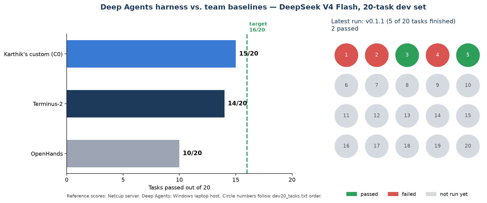

# Harshini Prasad — custom harness experiments (UTS iLab Project #15)

Branch `harshini-trial-run` of the UTS iLab Project #15 repository: building a custom
agent harness and comparing it with the client baselines on Terminal-Bench 2.1.

**Current work:** a LangGraph **Deep Agents** harness using **DeepSeek V4 Flash 0731**
(the model set by the client), compared against **Terminus-2** and **OpenHands**.

## Status

| | |
|---|---|
| Harness | Deep Agents, version 0.1.2 |
| Running now | 20-task dev set, version 0.1.2 |
| Best result so far | one-task test passed; 2 of 5 finished tasks passed in the first 20-task trial |
| Score to beat | Terminus-2 14/20 on the dev set (target: 16/20 before a full 89-task run) |



## Results by stage

### Stage 3 — Deep Agents harness, DeepSeek V4 Flash (October 2026, current)

Runs on the Windows laptop with Harbor and Docker; the model is called through OpenRouter
(DeepInfra FP8, the same route as the reference runs).

| Run | Harness | Tasks | Result | Notes |
|---|---|---|---|---|
| [`probe-openssl-v0.1.0`](results/harshini/deepagents/probe-openssl-v0.1.0.csv) | 0.1.0 | 1 | 0/1 (5 of 6 tests) | check script used a package the grader lacks |
| [`probe-openssl-v0.1.1`](results/harshini/deepagents/probe-openssl-v0.1.1.csv) | 0.1.1 | 1 | **1/1** | prompt fix: deliverables must use only preinstalled tools |
| [`dev20-v0.1.1`](results/harshini/deepagents/dev20-v0.1.1.csv) | 0.1.1 | 5 of 20 finished | **2 passed** | host went down; 2 failures were harness bugs |
| `dev20-v0.1.2` | 0.1.2 | 20 | running | first full dev-set run |

Fixes between versions are listed in the
[harness changelog](experiments/harshini-deepagents/CHANGELOG.md).

**Reference scores** (same model, Netcup server):

| Harness | Dev 20 | Full 89 |
|---|---:|---:|
| Terminus-2 (client baseline) | 14 | 52 |
| OpenHands (client baseline) | 10 | 44 |
| Karthik's custom harness (C0 / C0-NC) | 15 | 50 |

### Stage 2 — larger open model on UTS HPC (September 2026)

Qwen2.5-Coder-14B (AWQ) served with vLLM on the CETUS HPC, tasks run on the laptop over
an SSH tunnel, frozen 21-task subset.

| Check | Result |
|---|---|
| Oracle (official solutions) on the laptop | **21/21** tasks valid |
| Custom bash harness × 14B | **0/21** |
| mini-SWE-agent × 14B | not finished (4 of 21 trials, 0 passes) |

The model was too weak to pass any task, so this stage could not separate harnesses.
Details: [`results/harshini/README.md`](results/harshini/README.md).

### Stage 1 — team baseline with small local models (August 2026)

Qwen2.5-Coder 3B and 7B on three harnesses: **0 passes in all 126 trials**.
Archived write-up: [`docs/team-stage1.md`](docs/team-stage1.md).

## Next

1. Finish the `dev20-v0.1.2` run and compare it with the reference scores above.
2. Run Terminus-2 on the same laptop and tasks, so the comparison uses one host.
3. Add Langfuse tracing to the Deep Agents harness.
4. Run the full 89 tasks if the dev-set score reaches 16/20.

## Where things are

| Path | Contents |
|---|---|
| [`experiments/harshini-deepagents/`](experiments/harshini-deepagents/README.md) | Deep Agents harness, tests, task runner, changelog |
| [`results/harshini/deepagents/`](results/harshini/deepagents/) | one CSV per Deep Agents run |
| [`results/harshini/`](results/harshini/README.md) | Stage 2 results (Oracle, 14B runs) and the progress chart |
| [`experiments/itsha-bash-react/`](experiments/itsha-bash-react/README.md) | Stage 2 custom bash harness |
| [`hpc/`](hpc/) | CETUS PBS scripts for serving the Stage 2 model |
| [`docs/team-stage1.md`](docs/team-stage1.md) | archived team Stage 1 README |

Raw Harbor job folders (`jobs/`) are not committed. After a run:

```powershell
python experiments/harshini-deepagents/summarize_run.py dev20-v0.1.2 --dev20
uv run --no-project --with matplotlib python results/harshini/plot_progress.py
```
