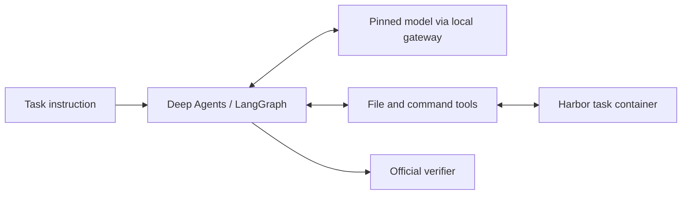

# Terminal-Bench Custom Harness

**A custom coding-agent harness built with Deep Agents and LangGraph.**

UTS iLab Capstone · Group 15-02

C0-NC gives a language model the tools and execution loop to solve real terminal tasks: inspect a workspace, edit files, manage commands and decide when its work is complete.

**The final custom harness solved 50 of 89 tasks, outperforming OpenHands by six tasks.** Its 56.18% pass rate was close to Terminus-2's 58.43%, demonstrating a working custom agent across a broad set of software, systems and data tasks.

[Results](#results) · [Design](#design) · [Getting started](#getting-started) · [Architecture](docs/architecture.md) · [Evaluation](docs/evaluation.md)

## Results

All three harnesses were evaluated on the same 89-task Terminal-Bench 2.1 set with DeepSeek V4 Flash 0731.

| Harness | Passed | Verified failures | Missing outcomes | Pass rate |
| --- | ---: | ---: | ---: | ---: |
| **C0-NC custom harness** | **50 / 89** | 39 | 0 | **56.18%** |
| Terminus-2 | 52 / 89 | 37 | 0 | 58.43% |
| OpenHands | 44 / 89 | 45 | 0 | 49.44% |

The custom result includes three separately completed setup-recovery attempts. The original run recorded 50 passes, 36 verified failures and three missing verifier outcomes; recovery produced three verified failures. The combined view covers **89 distinct tasks across 92 attempts**, not one uninterrupted 89-attempt run.

These are observed results from experiments conducted on separate dates, not proof of general superiority or statistical equivalence.

### Development and remaining tasks

| Harness | Development set | Remaining tasks | Full benchmark |
| --- | ---: | ---: | ---: |
| C0-NC | **15 / 20** | 35 / 69 | 50 / 89 |
| Terminus-2 | 14 / 20 | **38 / 69** | 52 / 89 |
| OpenHands | 10 / 20 | 34 / 69 | 44 / 89 |

The 20 development tasks are disclosed separately from the other 69. All three setup-recovery tasks belong to the remaining set.

[Explore the task-level results](results/) or reproduce the comparison locally:

```bash
python3 scripts/report_results.py
```

## Design

C0-NC is a single-agent harness integrated with Harbor's isolated task environments.

- **Workspace tools** operate inside the task container.
- **Managed commands** can be started, polled and interrupted through explicit handles.
- **Deadline-aware execution** follows the official task clock, with no added command-count or completion-repair quotas.
- **Explicit completion** lets the agent complete or abandon a task; only the official verifier determines success.
- **Runtime portability** supports images without a suitable Python interpreter through a verified fallback.
- **Execution records** retain trajectories, timings and available usage for analysis.



The model controller, completion contract, portable sandbox and command lifecycle are implemented in [src/uts_harness](src/uts_harness/).

## Getting started

### Inspect the results

The reporting script uses only Python's standard library. No API key, Docker environment or model call is needed.

```bash
git clone https://github.com/KarthikRamesh9149/UTS-ilab-Group-15-02.git
cd UTS-ilab-Group-15-02
python3 scripts/report_results.py
python3 scripts/report_results.py --json
```

### Install the harness

Use **Python 3.11 or newer**. Full task execution requires Linux, Docker/Harbor, the pinned portable Python bundle and an explicitly configured local model gateway.

```bash
python3 -m venv .venv
source .venv/bin/activate
python -m pip install -e .
```

The package exposes `NoCutoffCustomHarborAgent`, `NoCutoffCustomRunner`, `Condition` and `agent_factory`. It is a Harbor adapter, not a standalone paid-benchmark launcher. The client accepts only a per-trial token and a loopback gateway; provider routing and authorisation remain outside the agent.

[Read the architecture and integration requirements](docs/architecture.md).

### Run the offline tests

After installing the package:

```bash
python scripts/test_offline.py
```

These tests exercise the implementation and validate the saved results. The test runner clears provider credentials and blocks network connections.

## Evaluation setup

| Setting | Value |
| --- | --- |
| Benchmark | Terminal-Bench 2.1 · fixed 89-task set |
| Model | `deepseek/deepseek-v4-flash-0731` |
| Access | OpenRouter → DeepInfra FP8 · fallback disabled |
| Sampling | Temperature 1.0 · top-p 1.0 · high reasoning effort |
| Host | Native x86-64 Linux on Netcup |
| Scoring | Official binary verifier reward |
| Resources | Official per-task deadlines, CPU and memory limits |

[Evaluation methodology](docs/evaluation.md) explains the development split, recovery accounting and interpretation of the comparison. [configs](configs/) contains the saved study settings and task identities.

## Repository layout

```text
src/uts_harness/   Final custom harness
tests/            Offline harness and result tests
configs/          Evaluation settings and fixed task set
results/          Two baseline runs, custom run and setup recovery
scripts/          Result validation and reporting
docs/             Architecture and evaluation methodology
```

Built for the **UTS iLab Capstone, Group 15-02**.
