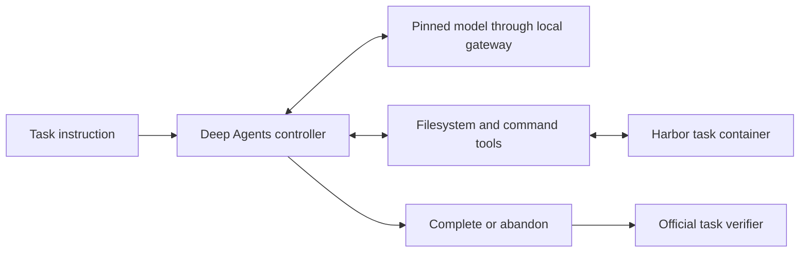

# Harness architecture

C0-NC is a single-agent coding harness built with Deep Agents and LangGraph. Harbor supplies the isolated task environment and official verifier. The harness supplies the model controller, workspace tools, command lifecycle and explicit completion behaviour.

## Controller and tools

The controller streams graph states so that tool observations are retained even if a later request fails. Subagents, persistent memory and automatic summarisation are disabled in the measured design. Its tools support workspace inspection and editing, starting commands, polling known command handles, interrupting owned process groups and reporting completion or abandonment.

Completion is an agent decision, not a benchmark score. The official verifier runs independently after agent execution. Background task services remain available until verification; the host then cleans up commands and destroys the task container.

## Deadline-aware execution

The final runner follows the original official task deadline. Command execution uses the remaining task time unless the agent selects a shorter timeout. The final C0-NC design does not add C3's remaining-time advice or fixed command-count, background-job-count or completion-repair quotas. Output and context windows remain finite.

## Runtime portability

Some task images do not contain a suitable Python interpreter. The portable backend verifies and prepares a pinned Python bundle without replacing the image's existing interpreter. Captured command output uses the final encoded-helper transport.

## Model boundary

The model client accepts only an explicit `http://127.0.0.1:<port>/v1` gateway and a per-trial token. It does not accept a direct provider URL. Sampling and output settings match the saved evaluation configuration. Provider routing, authorisation, physical-request retries and revocation belong to the host gateway, not to the agent's tool loop.

## Package layout

| Module | Responsibility |
| --- | --- |
| `agent.py` | Final C0-NC Harbor adapter and factory |
| `controller.py`, `control.py` | Model/tool loop and completion contract |
| `deadlines.py`, `jobs.py` | Task clock and managed command lifecycle |
| `capture_sandbox.py`, `portable_sandbox.py` | Final container execution and output capture |
| `python_runtime.py` | Verified portable interpreter preparation |
| `model.py`, `text_transport.py` | Explicit gateway client and text-only transport |
| `lifecycle.py`, `private_io.py` | Trial lifecycle and private evidence files |

The package is an extraction of the evaluated implementation with package-relative imports and small shared filesystem/configuration helpers. The recorded benchmark results belong to the original evaluated source, not a new run of this packaged distribution.
