# Process flowchart — small-model baseline run (shruthi-eval)

This is a visual, end-to-end record of how the individual "small-weight model" baseline
check was carried out for the weekly team report, including the real setbacks hit along
the way (kept in deliberately — this is a record of what actually happened, not a
cleaned-up version of events).

**Scope note:** this is a personal, one-off check for the weekly report. It is
**separate** from the team's formal 21-task / 3-harness / 2-model comparison matrix
described in the main [README](../README.md) and [docs/setup-notes.md](setup-notes.md).
It uses Harbor's own `terminus-2` agent (not the team's custom harness) against the full
`terminal-bench-2` dataset (not the frozen 21-task subset), via OpenRouter.

```mermaid
flowchart TD
    A[Install Docker Desktop] --> B[Install Harbor CLI]
    B --> C[Confirm Docker daemon running<br/>and harbor --version works]
    C --> D[Clone repo, checkout<br/>existing branch shruthi-eval]
    D --> E[Get OpenRouter API key<br/>with credit]

    E --> F{Set OPENROUTER_API_KEY<br/>so Harbor can use it}
    F -->|attempt 1: export with<br/>space around '='| F1[Failed — var stayed empty]
    F1 -->|attempt 2: '!' prefixed export| F2[Failed — each terminal command<br/>is a fresh shell, nothing persists]
    F2 --> F3[Fix: write key to a local<br/>.env file OUTSIDE the repo]
    F3 --> G[Verify .env file exists<br/>and is not tracked by git]

    G --> H{Validate the exact command:<br/>agent, model, dataset}
    H --> H1["harbor run --print-config<br/>(local-only dry run)"]
    H1 -.->|looked valid but never<br/>touched the network| H2[False sense of security]

    H2 --> I[Launch real job:<br/>terminus-2 + claude-3-haiku<br/>via OpenRouter, 5 tasks]
    I --> J{Job result}
    J -->|Failed fast| K["Error: Dataset 'terminal-bench-2'<br/>not found in live registry"]
    K --> L[Investigate correct dataset slug<br/>via registry access checks]
    L --> M["Correct slug needs org/name form:<br/>terminal-bench/terminal-bench-2-1"]
    M --> N{Check Harbor Hub auth}
    N -->|Not authenticated| O["Blocked: needs GitHub OAuth login<br/>— can only be done by the user<br/>in their own browser"]
    O --> P[User runs: harbor auth login<br/>signs in via GitHub]
    P --> Q[Re-run the job with the<br/>corrected dataset name]

    Q --> R{Job completes?}
    R -->|Yes| S[Collect real results:<br/>tasks passed, accuracy,<br/>tokens used, approx. cost]
    R -->|No| T[Diagnose failure,<br/>report honestly, do not<br/>fabricate numbers]

    S --> U[Write plain-English summary<br/>to results/shruthi-small-model-baseline.md]
    U --> V[Update this flowchart<br/>with final outcome]
    V --> W[git add, commit with<br/>clear message]
    W --> X[git push to shruthi-eval<br/>NOT merged into main]
    X --> Y[Paste plain-English summary<br/>into team group chat]
```

## Key lessons captured in this run

1. **`--print-config` is a local-only dry run.** It resolves the JobConfig shape but
   never contacts the Harbor Hub registry, so it can't confirm a dataset name actually
   exists. A clean `--print-config` is not proof the run will work.
2. **Shell state doesn't persist between separate terminal commands** in this setup —
   an `export` in one command is gone by the next. Secrets that need to survive into a
   later command should go into a file (e.g. `--env-file`) instead.
3. **Dataset names on the current Harbor Hub use an `org/name` package format**
   (e.g. `terminal-bench/terminal-bench-2-1`), not the bare legacy name.
4. **Harbor Hub requires GitHub OAuth login** even to resolve dataset metadata for a run
   that otherwise executes entirely locally in Docker. This is a manual, browser-based
   step that only the account owner can complete.

## Final outcome

The "Job completes?" branch resolved **Yes**. After signing in via GitHub OAuth
(`harbor auth login`) and correcting the dataset name to the `org/name` package format
(`terminal-bench/terminal-bench-2-1`), the real run completed cleanly:

- 5/5 tasks ran to completion, 0 errors
- 1 passed, 4 failed → **20% pass rate**
- 31,638 input + 8,679 output tokens (40,317 total)
- **~$0.0188 USD**, ~12 minutes 15 seconds wall-clock

Full numbers and per-task breakdown are in
[`results/shruthi-small-model-baseline.md`](../results/shruthi-small-model-baseline.md).
