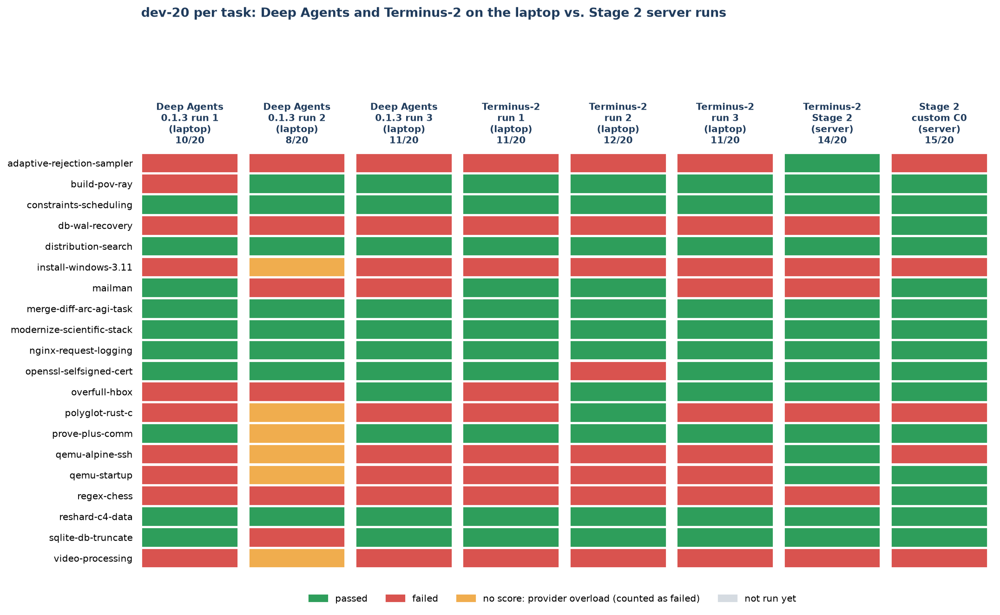

# Findings — Deep Agents harness and same-host experiments

**Scope.** Everything in this file was built, run and analysed on this branch
(`harshini-trial-run`): the Deep Agents harness, the pinned Terminus-2 runner, every
laptop run, the repeat study and the analysis scripts. Reference numbers come from the
project's Stage 2 runs on the Netcup server, read from committed CSVs on `main`
(extracted to [`reference/stage2-reference-89.csv`](reference/stage2-reference-89.csv)
by [`compare_reference.py`](compare_reference.py)).

All runs use the same model and route: DeepSeek V4 Flash 0731 on DeepInfra FP8 via
OpenRouter, temperature 1.0, reasoning effort high, 384k max output tokens. Every
result is one run per task unless stated. Last updated 10 October 2026, after the
repeat study finished.

## Summary

1. **Repeat study (3 runs each, same laptop, alternating):** the Deep Agents harness
   (0.1.3) scored **10, 8 and 11** of 20 (mean 9.7); Terminus-2 scored **11, 12 and 11**
   (mean 11.3). Terminus-2 is slightly ahead and more consistent, but the gap (1.7 tasks)
   is about the size of one harness's run-to-run spread (3 tasks).
2. **A single dev-20 run is not a reliable score.** The same harness, model and settings
   moved by up to 3 tasks between runs, more than the 1-task differences that separate
   harnesses in the single-run server results.
3. **The host matters.** Terminus-2 averaged **11.3** on the laptop against **14** on the
   server with identical settings. Three tasks it passed on the server
   (`adaptive-rejection-sampler`, `qemu-alpine-ssh`, `qemu-startup`) failed in all three
   laptop runs; the two `qemu` tasks also fail for the Deep Agents harness.
4. In the Stage 2 server runs (89 tasks), the three harnesses solve **different tasks**:
   **62** tasks are solved by at least one harness, against **52** for the best single
   one, and **27** are solved by none. The custom harness leads only on dev-20, the set
   it was selected on; on the other 69 tasks Terminus-2 leads (38 vs 35).
5. Harness bugs found on real tasks, not in offline tests, were the main obstacle early
   on: an empty model reply ending a run, images without `python3`, and provider
   overload. Each is fixed and covered by the offline test (10/10 checks).

## 1. Deep Agents harness on dev-20 (run 1 of the repeat study)

[`deepagents/dev20-v0.1.3.csv`](deepagents/dev20-v0.1.3.csv)

| Outcome | Tasks |
|---|---:|
| Passed | 10 (9 finished by the model, 1 at the deadline) |
| Failed at the time limit | 7 |
| Failed after the model declared it was done | 3 |

- Median agent time per pass: **5.9 min**; total agent time: **5.9 h**; cost: **US$0.40**.
- **Near-miss, `build-pov-ray`:** the model downloaded, built and ran POV-Ray 2.2 and
  rendered the test scene (2 of 3 checks passed). It unpacked the archives into
  subfolders, so the expected `/app/povray-2.2/file_id.diz` was missing. A completion
  check on the required file layout is the obvious next lever.
- **Time limits dominate:** 7 of 10 failures ran out of time, the same pattern as the
  Stage 2 server runs (timeouts are the largest failure group for all three harnesses).

## 2. Same host vs. server: the host effect

[`deepagents/dev20-terminus2-r1.csv`](deepagents/dev20-terminus2-r1.csv),
[`-r2`](deepagents/dev20-terminus2-r2.csv), [`-r3`](deepagents/dev20-terminus2-r3.csv) ·
chart: [`dev20-tasks.png`](dev20-tasks.png)

Terminus-2 here is Harbor's own agent with only the connection pinned
([`harness/terminus_pinned.py`](../../experiments/harshini-deepagents/harness/terminus_pinned.py)).

| dev-20 | Passed |
|---|---:|
| Terminus-2, server (Stage 2, 1 run) | 14 |
| Terminus-2, laptop (3 runs) | 11, 12, 11 — mean 11.3 |
| Deep Agents 0.1.3, laptop (3 runs) | 10, 8, 11 — mean 9.7 |

- **Lost on the laptop in every run:** `qemu-alpine-ssh` and `qemu-startup` (both boot a
  virtual machine inside the task container) and `adaptive-rejection-sampler`. Terminus-2
  passed all three on the server; the Deep Agents harness also fails both `qemu` tasks.
  This points to the host, not the harness. A Windows Oracle run of these tasks would
  confirm it.
- **Gained on the laptop:** Terminus-2 passed `mailman` (2 of 3 runs) and
  `polyglot-rust-c` (1 of 3), which it failed on the server — swings in both directions.
- **Implication:** server scores and laptop scores should not be compared directly. The
  fair comparison for this harness is Terminus-2 on the same laptop (section 3).

## 3. Repeat study: run-to-run spread and same-host comparison

[`repeat_study.py`](../../experiments/harshini-deepagents/repeat_study.py) ran three
dev-20 runs of each harness on the laptop, alternating between them (Deep Agents run 1,
Terminus-2 run 1, Deep Agents run 2, …) from 5 to 10 October, with the harness frozen at
0.1.3. Every other score for this model is a single run at temperature 1.0, so the size
of the run-to-run spread was unknown. Chart: [`progress.png`](progress.png).

| Run | Deep Agents 0.1.3 | Terminus-2 |
|---|---:|---:|
| 1 | 10 | 11 |
| 2 | 8 | 12 |
| 3 | 11 | 11 |
| **Mean (range)** | **9.7 (8–11)** | **11.3 (11–12)** |
| Tasks passed at least once | 12 | 13 |
| Cost per run (US$) | 0.40, 0.31, 0.39 | 0.40, 0.27, 0.28 |
| Median agent minutes per pass | 5.9, 5.0, 6.8 | 6.2, 9.9, 5.8 |

CSVs: [`dev20-v0.1.3`](deepagents/dev20-v0.1.3.csv),
[`-r2`](deepagents/dev20-v0.1.3-r2.csv), [`-r3`](deepagents/dev20-v0.1.3-r3.csv);
Terminus-2 as in section 2.

**Per task** (passes out of 3 runs):

| Group | Tasks |
|---|---|
| Both harnesses, every run (6) | `constraints-scheduling`, `distribution-search`, `merge-diff-arc-agi-task`, `modernize-scientific-stack`, `nginx-request-logging`, `reshard-c4-data` |
| Neither harness, any run (7) | `adaptive-rejection-sampler`, `db-wal-recovery`, `install-windows-3.11`, `qemu-alpine-ssh`, `qemu-startup`, `regex-chess`, `video-processing` |
| Terminus-2 more often (6) | `build-pov-ray` 2 vs 3, `prove-plus-comm` 2 vs 3, `sqlite-db-truncate` 2 vs 3, `mailman` 1 vs 2, `overfull-hbox` 1 vs 2, `polyglot-rust-c` 0 vs 1 |
| Deep Agents more often (1) | `openssl-selfsigned-cert` 3 vs 2 |

- **Run-to-run spread is large.** The Deep Agents harness moved by 3 tasks between
  identical runs; 7 of the 20 tasks flip between pass and fail across runs of at least
  one harness. Single-run differences of 1–2 tasks (such as 14 vs 15 on the server) are
  within this spread.
- **Terminus-2 is slightly ahead on the same host.** It passed more often on 6 tasks and
  less often on 1. With 3 runs this is not conclusive: a sign test on those 7 tasks gives
  p ≈ 0.13 (two-sided).
- **Provider overload affected Deep Agents run 2.** Six tasks ended with rate-limit
  errors during an overload window on 8–9 October and have no verifier result; they are
  counted as failed. On the 14 tasks it did not affect, the scores are Deep Agents 9, 8,
  10 and Terminus-2 10, 10, 10. Two of the six (`prove-plus-comm`, `polyglot-rust-c`)
  are in the "Terminus-2 more often" group, so part of the gap comes from overload, not
  from the harness. The queued re-run of these six did not execute (Harbor reused the
  stored results), so the official scores are the first attempts.
- **Lesson for the harness:** when retries run out near the deadline, 0.1.3 raises and
  the task gets no verifier result. Ending the run instead, so the grader checks the
  current state (as Harbor does on a timeout), is the next fix (0.1.4).
- **Cost and time are similar:** both harnesses cost about US$0.27–0.40 per 20-task run.

## 4. Stage 2 server results: where the harnesses differ

From [`reference/stage2-reference-89.csv`](reference/stage2-reference-89.csv), 89 tasks,
one run each.

| | Terminus-2 | OpenHands | Stage 2 custom (C0-NC) |
|---|---:|---:|---:|
| Passed (of 89) | 52 | 44 | 50 |
| Tasks only this harness solved | 4 | 2 | 5 |
| Median agent minutes per pass | 8.5 | 6.6 | 5.6 |
| Median output tokens per pass | 17,260 | 12,792 | 10,414 |
| Known input tokens (all tasks) | 24.2M | 52.1M | 68.3M |
| Known cost (all tasks) | US$0.92 | US$1.46 | US$1.71 |

- **Different harnesses win different tasks.** Picking the right harness per task would
  solve 62/89 (70%) against 52/89 for the best single harness. Tasks solved only by
  C0-NC: `hf-model-inference`, `mailman`, `mteb-leaderboard`, `polyglot-rust-c`,
  `regex-chess`. Only by Terminus-2: `circuit-fibsqrt`, `pytorch-model-recovery`,
  `qemu-alpine-ssh`, `schemelike-metacircular-eval`.
- **27 tasks are solved by no harness** — a ceiling that harness changes alone have not
  moved.
- **Trade-off, not a win:** C0-NC finishes its passes faster with fewer output tokens,
  but sends about 3× Terminus-2's input tokens and has the highest known cost. Agent
  time includes waits on rate-limited requests, so it is not a clean speed measure, and
  costs are incomplete (hundreds of requests per run have no recorded cost).
- **Time limits are the main failure mode for every harness:** 20 of Terminus-2's 37
  non-passes, 29 of OpenHands' 45 and 25 of C0-NC's 39 hit the agent time limit.

**Head-to-head (per task, 89 tasks; C0-NC's 3 setup failures counted as not passed):**

| Pair | Both pass | Only first | Only second | Neither |
|---|---:|---:|---:|---:|
| C0-NC vs Terminus-2 | 42 | 8 | 10 | 29 |
| C0-NC vs OpenHands | 36 | 14 | 8 | 31 |
| Terminus-2 vs OpenHands | 39 | 13 | 5 | 32 |

**dev-20 vs. the other 69 tasks:**

| | dev-20 | other 69 |
|---|---:|---:|
| Terminus-2 | 14 | 38 |
| OpenHands | 10 | 34 |
| C0-NC | 15 | 35 |

- The custom harness leads only on dev-20, and dev-20 is where it was chosen: C0 was the
  best of four variants on those 20 tasks (C0 15, C1 14, C2 14, C3 13). On the 69 tasks
  not used for selection, Terminus-2 leads (38 vs 35).
- C0-NC's own validation run on the same 20 tasks scored 11/20, against 15/20 inside its
  final run (recorded conditions were not identical). A single dev-20 score can move by
  several tasks, which is why the repeat study (section 3) matters.
- The overall differences (52 vs 50 vs 44) are within single-run noise; the paired
  statistical tests are in the Stage 2 analysis on `main`
  (`experiments/saranya-analysis/`).

## 5. Harness engineering findings

Found on real tasks and fixed (see the
[harness changelog](../../experiments/harshini-deepagents/CHANGELOG.md)):

| Finding | Effect before the fix | Fix |
|---|---|---|
| Graders run in a fresh environment | A check script used a pip-installed package the grader lacked (`openssl-selfsigned-cert` 5/6) | Prompt rule: deliverables use only preinstalled tools (0.1.1) |
| Some task images have no `python3` | Deep Agents' file tools failed on the R image | Shell-based write preflight; Python-backed tools hidden (0.1.2) |
| The model can return an empty reply | `build-pov-ray` ended at 14 of 200 minutes | Nudge to continue, up to 3 times (0.1.2) |
| Provider overload (HTTP 429, `engine_overloaded`) | Three tasks ended with no verifier result | Deadline-bounded retry with backoff, no count cap (0.1.3) |

## 6. Infrastructure findings

- **Terminus-2 runs on Windows with Harbor 0.22** when the OpenRouter key and provider
  route are passed in the agent's LLM settings (`terminus_pinned.py`); the one-task probe
  passed with no authentication errors.
- **Laptop sleep stops runs.** The run launchers hold a Windows "system required"
  request, which prevents idle sleep but not Modern Standby from closing the lid or the
  power button. On 5–6 October the laptop sat in Modern Standby for about 24 h during
  Terminus-2's `regex-chess` (run 1); Harbor's timers paused, and the trial ended with
  24.5 h of recorded agent time. It was the only trial that overlapped standby, and it
  was set aside to be re-run rather than counted.
- **CETUS (UTS HPC) cannot run Harbor** (no Docker; Stage 2 work, see the
  [results README](README.md)), so the laptop is the run host for this branch.

## 7. Gaps in the project's evidence (review of all branches, 5 October 2026)

| Gap | Status in the project | Covered here? |
|---|---|---|
| Run-to-run variation on the same tasks | Never measured; the matched repeat run had not started a scored task | Yes — up to 3 tasks on dev-20 (section 3) |
| Same-host comparison against a baseline | Custom and baseline runs were days apart under different provider load | Yes — Terminus-2 on the same laptop, alternating runs (sections 2–3) |
| Single-lever tests of the brief's four levers (system prompt, tools, context management, retries) | Only the system prompt was tested as a variant (C1, C2); C3 and C0-NC bundled several changes (`experiments/saranya-changelog/HARNESS_CHANGELOG.md` on `main`) | Next — one change at a time on this harness |
| Failure analysis from agent logs | Failure categories come from recorded fields only | Partly — near-miss analysis (section 1) |
| Step-by-step tracing (Langfuse) | Not present on any branch | Planned |

## Open questions

1. How much of the laptop–server gap is the host? (Windows Oracle on the `qemu` tasks
   and `adaptive-rejection-sampler`.)
2. Does a single change — a file-layout completion check — recover near-misses like
   `build-pov-ray` without losing other tasks? Given the spread in section 3, any
   single-lever test needs repeated runs to show an effect.
3. Does ending gracefully when retries run out (0.1.4) remove the overload losses seen
   in Deep Agents run 2?
